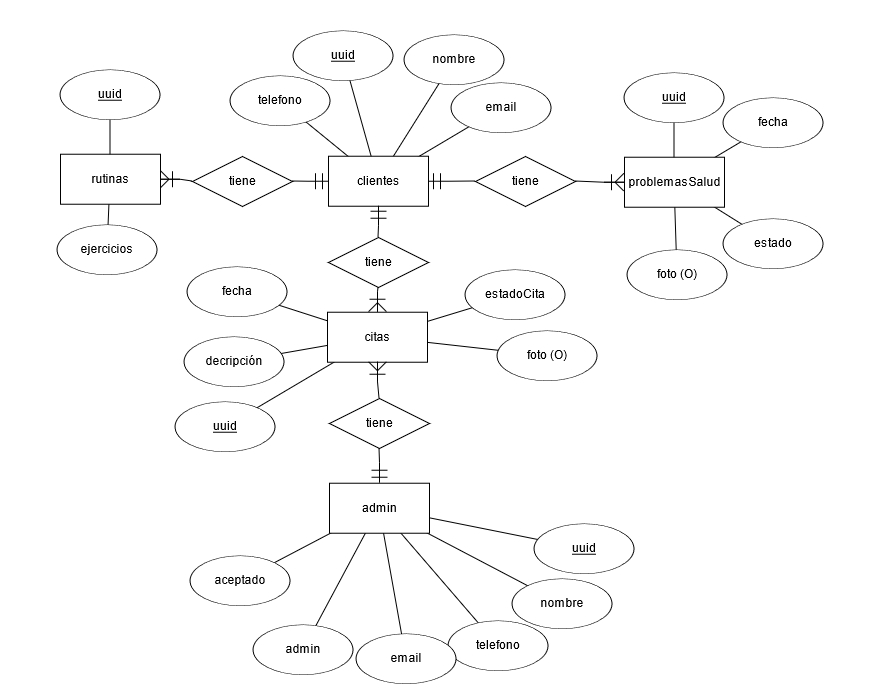

# Anteproyecto - ActiveLife

# **Titulo del proyecto**

- ActiveLife

# Nombre de los autores del proyecto

- Pablo García Muñoz
- Antonio Luis García Guerrero

# Descripción del proyecto

Proyecto orientado a temas de salud, disponible tanto en web ( Angular / Ionic ) como en movíl      ( Kotlin ), esta hecho para dos tipos de usuarios, los clientes y los administradores con distintas funciones cada uno y con notificaciones y recordatorios.

### **Cliente:**

- Creación de rutinas de ejercicios personalizadas.
- Solicitud de citas con administradores (entrenadores o médicos).
- Registro de problemas de salud, lesiones u otras incidencias relevantes.

### Administradores:

- Edición de rutinas de ejercicios de los usuarios (si se le otorgan los permisos correspondientes).
- Respuesta a las citas solicitadas por los clientes.
- Gestión de usuarios.

# Objetivos del proyecto

Crear una aplicación útil para que los clientes sean capaces de crear rutinas con la app, también que en el caso de que tengan algún problema de salud puedan reportarlo a los administradores para que puedan darles una solución, todo esto con el añadido de notificaciones de correo, también el poder compartir la rutina de ejercicios, también en el caso de querer registrarte como administradores un SuperAdmin lo controle.

# Tecnologías Utilizadas

### Web

- Frontend: Angular con Ionic, Integración de Servicio de Correo Electrónico.
- Backend: Firebase.

### **Movil**

- Frontend: Android con kotlin.
- Backend: Firebase.

# Esquema E/R de la base de datos

### Colección "Clientes":

- Contiene documentos para cada cliente, identificados por su UUID.
- Campos: nombre, email, numTelefono.
- Subcolección "RutinasEjercicios": Contiene documentos que representan las rutinas de ejercicios creadas por el cliente.

### Colección "Administradores":

- Contiene documentos para cada administrador, identificados por su UUID.
- Campos: nombre, email, numTelefono, admin y aceptado ( Para que el SuperAdmin los acepte como admin)

### Colección "ProblemasSalud":

- Contiene documentos que representan los problemas de salud reportados por los clientes.
- Campos como la descripción del problema, la fecha, el estado, fotografía.

### Colección "Citas":

- Contiene documentos que representan las citas programadas por los clientes con los administradores.
- Cada documento puede contener campos como la fecha, la hora, el estado de la cita, fotografía, descripción.
- Relación:
    - "clienteId": Este campo contendrá el UUID del cliente que solicitó la cita.
    - "adminId": este campo contendrá el UUID del administrador al que se le asignó la cita.

# Enlace al repositorio
- Web: https://github.com/PabloGM1204/TFG-ActiveLife-Angular
- Movíl: https://github.com/AntonioLuisGarcia/ActiveLife
